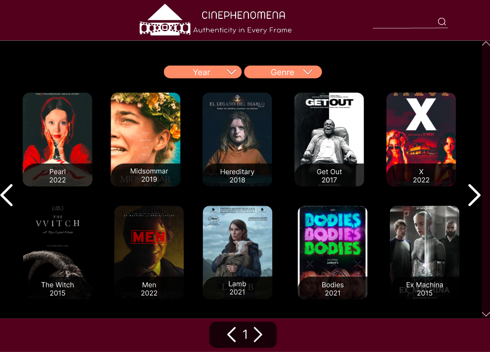
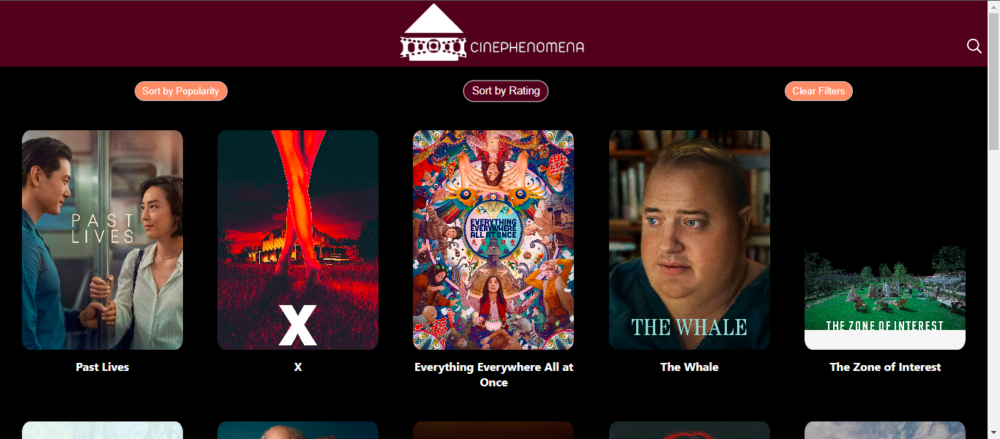
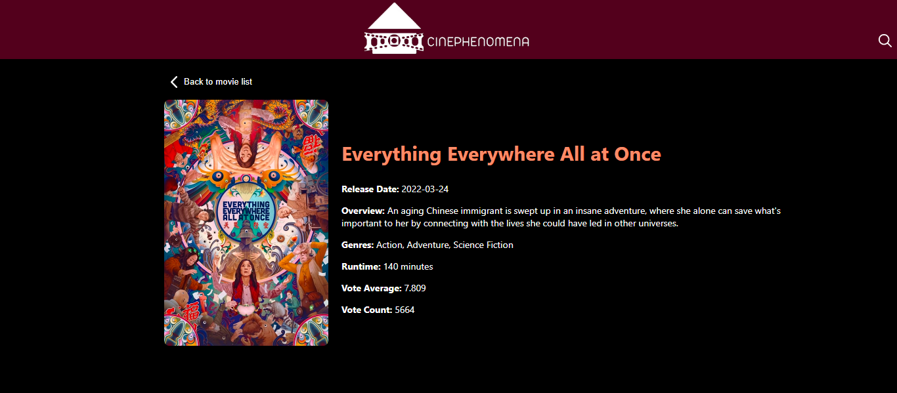

# CinePhenomena

## Description
CinePhenomena is a curated catalog of movies showcasing the cinematic works of A24, a prominent independent film production and distribution company. Explore and discover exciting and diverse films that have captured the attention of audiences worldwide.

## Features
- **Movie Exploration:** Browse through an extensive catalog of A24 films.
- **Movie Details:** Get detailed information about each movie, including synopsis, cast, and more.
- **Advanced Search:** Use the search feature to find specific movies.
- **Intuitive Interface:** Enjoy a user-friendly and visually appealing interface.

## Prototypes and Deployment

### Prototypes
The initial design and layout of CinePhenomena were carefully crafted through multiple iterations and wireframing sessions. Here are some snapshots of the early prototypes:

### Deployment 
Here are some screenshots of how CinePhenomena lookse:

## Installation
1. Clone the repository: `git clone https://github.com/YourUsername/CinePhenomena.git`
2. Install dependencies: `npm install`
3. Start the application: `npm start`

## Technologies Used
- React
- Vite
- TypeScript
- Vercel

## Contributions
Contributions are welcome! If you encounter any issues or have ideas for improvements, please open an issue or submit a pull request.

## About the Developer
CinePhenomena was developed by **Ivonne Conde**, in collaboration with [**Laboratoria**](https://github.com/Laboratoria). Connect with me on [**LinkedIn**](https://www.linkedin.com/in/ivonne-conde/) for more projects and collaborations.

